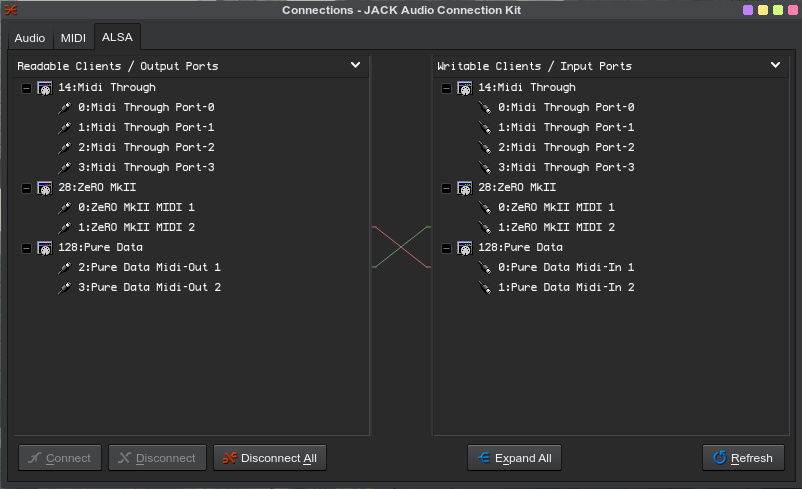

# novation-zero-sl-mkII-pd-adbstraction

Pure Data abstractions for controlling leds and LCD display of the Novation Zero-SL mkII controller

Note: requires 'tof' library (for ASCII to decimal conversion) to be installed in externals.

Connect the second output of the SL-MKII numbered 2 to the first pure data midi input 1

Connect the first pure data midi output 1 to the SL-MKII input number 2:

Then open slHelp.pd

